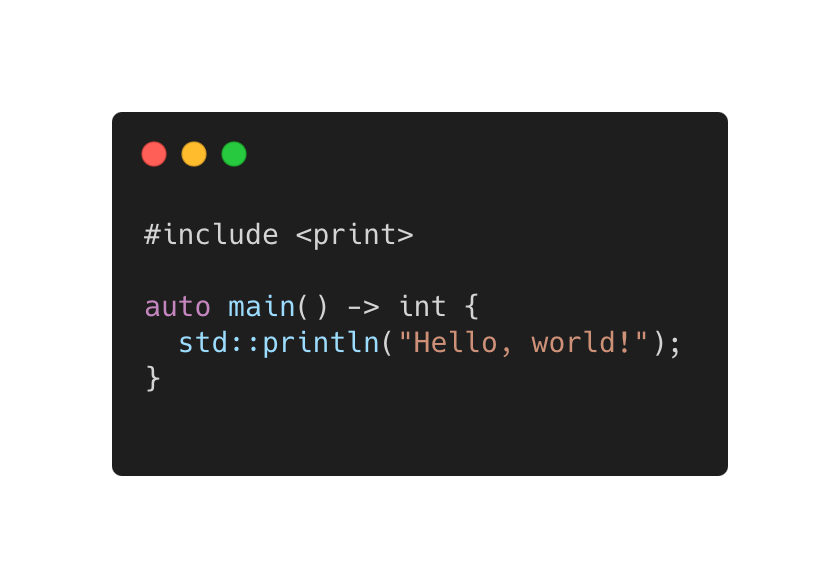

# Modern C++ course

## What this course is?

* This course aimed at inexperienced developers as well as experienced developers with no knowledge of Modern C++.
* This course covers concepts from C++98 to C++26, while keeping modern C++ in mind.
* The corresponding C++ version is indicated for each concept and feature.

## Outline

* Introdcution
* Language basics
* Object Oriented Programming (OOP)
* Core Modern C++
* Modern C++ Expert
* Advanved Programming
