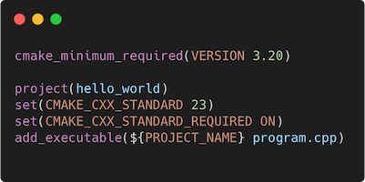
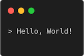

# Modern C++ course

## What this course is?

* Free and open-source ([MIT License](LICENSE.md)).
* This course aimed at inexperienced developers as well as experienced developers with no knowledge of Modern C++.
* This course covers concepts from C++98 to C++23, while keeping modern C++ in mind.
* The corresponding C++ version is indicated for each concept and feature.
* This course was inspired in part by [cpluspluscourse](https://github.com/hsf-training/cpluspluscourse).

## Example

### source.cpp

### CMakeLists.txt

### Console output

## Content

* [course](course/README.md) contains Keynote (macOS), PowerPoint (Windows) and PDF (Universal) files.
* [docs](docs/README.md) contains diagrams and pictures from the slides.
* [examples](examples/README.md) contains examples from the slides.
* [exercises](exercises/README.md) contains exercises from the slides.

## Course

* [Modern C++ course full](https://raw.github.com/gammasoft71/modern_cpp_course/blob/main/course/pdfs/modern_cpp_course_full.pdf)

## Outline

* [Introduction](course/pdfs/introduction.pdf)
  * What this course is?
  * History
  * Wy using C++?
  * References
  * C++ development tools
* [Language basics](course/pdfs/language_basics.pdf)
  * Hello World
  * Core syntax and types
  * Arrays and Pointers
  * Scopes / namespaces
  * Class and enum types
  * References
  * Functions
  * Operators
  * Control structuees
  * Headers and interfaces
  * auto keyword
  * inline keyword
  * Assertions
* [Object Oriented Programming (OOP)](course/pdfs/object_oriented_programming.pdf)
  * Objects and Classes
  * Inheritance
  * Constructors / Destructors
  * Static members
  * Allocating objects
  * Advanced Oriented Object
  * Type casing
  * Opertor overloading
  * Function objets
  * Name Lookups
* [Core Modern C++](course/pdfs/core_modern_cpp.pdf)
  * Constness
  * Constant expressions
  * Exceptions
  * Move semantics
  * Copy elision
  * Templates
  * Lambdas
  * The Standard Library
  * Ranges
  * RAII and Smart pointers
  * Initialization
* [Modern C++ Expert](course/pdfs/modern_cpp_expert.pdf)
  * The <=> operator
  * Variadic templates
  * Perfect forwarding
  * SFINAE
  * Concepts
  * Modules
  * Coroutines
* [Advanved Programming](course/pdfs/advanced_programming.pdf)
  * Using CMake 
  * ...
