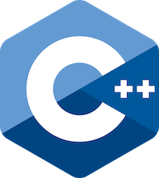

# C++ course

Contains modern **C++** course.
Contains an outline of a modern C++ course.

This course is aimed at inexperienced developers as well as experienced developers with no knowledge of **C++**.

* The course covers concepts from **C++98** to **C++26**, while keeping modern **C++** in mind.
* The corresponding **C++** version is indicated for each concept and feature.
* This course is not intended to be a **C** course, nor does it include the learning of **C** and the transition to **C++**.
* I consider **C** and **C++** to be two different languages, even if the root is the same.
* Mixing **C++** and **C** could influence the way of thinking and coding, whether in **C++** or **C**. 
* **C++** and **C** courses must therefore be kept quite separate. In the same way as **Java** and **CSharp** courses are distinct.
* **C++** can be taught both before and after **C**.
