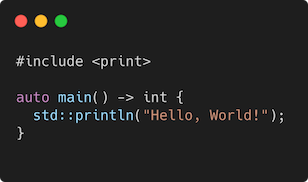

# Modern C++ course

## What this course is?

* Free and open-source ([MIT License](LICENSE.md)).
* This course aimed at inexperienced developers as well as experienced developers with no knowledge of Modern C++.
* This course covers concepts from C++98 to C++26, while keeping modern C++ in mind.
* The corresponding C++ version is indicated for each concept and feature.

## Outline

* Introdcution
  * What this course is?
  * History
  * Wy using C++?
  * References
  * C++ development tools
* Language basics
  * Hello World
  * Core syntax and types
  * Arrays and Pointers
  * Scopes / namespaces
  * Class and enum types
  * References
  * Functions
  * Operators
  * Control structuees
  * Headers and interfaces
  * Auto keyword
  * inline keyword
  * Assertions
* Object Oriented Programming (OOP)
  * Objects and Classes
  * Inheritance
  * Constructors / Destructors
  * Static members
  * Allocating objects
  * Advanced Oriented Object
  * Type casing
  * Opertor overloading
  * Function objets
  * Name Lookups
* Core Modern C++
  * Constness
  * Constant expressions
  * Exceptions
  * Move semantics
  * Copy elision
  * Templates
  * Lambdas
  * The Standard Template Library 
  * The Standard Library
  * Ranges
  * RAII and Smart pointers
  * Initialization
* Modern C++ Expert
  * The <=> operator
  * Variadic templates
  * Perfect forwarding
  * SFINAE
  * Concepts
  * Modules
  * Coroutines
* Advanved Programming
  * Using CMake 
  * ...
