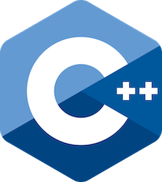

# pdf

Contains the PDF (Universal) files of Modern C++ course.

* [00_modern_cpp_course_outline](00_modern_cpp_course_outline.pdf) Contains the outline slides.
* [01_modern_cpp_course_introduction](01_modern_cpp_course_introduction.pdf) Contains the "Introduction" slides.
* [02_modern_cpp_course_language_basics](02_modern_cpp_course_language_basics.pdf) Contains the "Language Basics" slides.
* [03_modern_cpp_course_object_oriented_programming](02_modern_cpp_course_language_basics.pdf) Contains the "Object Oriented Programming  (OOP)" slides.
* [04_modern_cpp_course_core_modern_cpp](02_modern_cpp_course_language_basics.pdf) Contains the language "Core Modern C++" slides.
* [05_modern_cpp_course_modern_cpp_expert](05_modern_cpp_course_modern_cpp_expert.pdf) Contains the "Modern C++ Expert" slides.
* [06_modern_cpp_course_advanced_programming](06_modern_cpp_course_advanced_programming.pdf) Contains the "Modern C++ Expert" slides.
* [modern_cpp_course_full](modern_cpp_course_full.pdf) Contains all slides.

> ** Warning**
> These files were generated from [keynote](../keynotes/README.md) files.
>
> Changes made to these files will be lost when they are regenerated.
