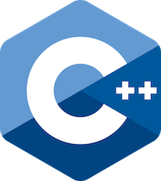

# Language basics examples

Contains Modern C++ course language basics examples.

* [hello_world_cpp98](hello_world_cpp98/README.md) Modern C++ course `hello_world_cpp98` example.
* [hello_world_cpp23](hello_world_cpp23/README.md) Modern C++ course `hello_world_cpp23` example.
* [main](main/README.md) Modern C++ course `main` example.
* [main_with_arguments](main_with_arguments/README.md) Modern C++ course `main_with_arguments` example.
* [comment](comment/README.md) Modern C++ course `comment` example.
* [basic_types](basic_types/README.md) Modern C++ course `basic_types` example.
* [basic_types_2](basic_types_2/README.md) Modern C++ course `basic_types_2` example.
* [basic_types_3](basic_types_3/README.md) Modern C++ course `basic_types_3` example.
