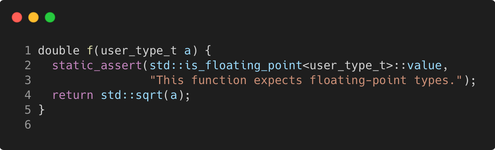

# static_assert

Modern C++ course `static_assert` example.



## Source

[static_assert.cpp](static_assert.cpp)

[CMakeLists.txt](CMakeLists.txt)

## Output

```
result = 3
result = Assertion failed: (a > .0), function f, file static_assert.cpp, line 7.
```

## Build and run

To build `static_assert` project, open "Terminal" and type following lines:

### Windows :

``` shell
mkdir build && cd build
cmake .. 
start static_assert.sln
```

Select `static_assert` project and type Ctrl+F5 to build and run it.

### macOS :

``` shell
mkdir build && cd build
cmake .. -G "Xcode"
open ./static_assert.xcodeproj
```

Select `static_assert` project and type Cmd+R to build and run it.

### Linux :

``` shell
mkdir build && cd build
cmake .. 
cmake --build . --config Debug
./static_assert
```

### Linux with Visual Studio Code :

* Launch Visual Studio Code.
* Select `File/Open Folder...` menu.
* Select `static_assert` folder and open it.
* Build and Run `static_assert` project.
