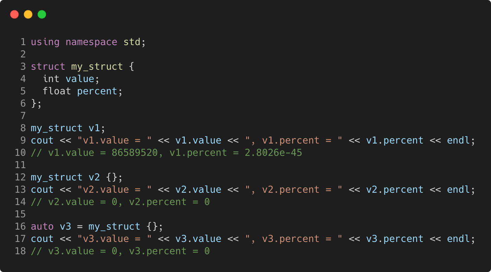

# auto_always_initialized

Modern C++ course `auto_always_initialized` example.



## Source

[auto_always_initialized.cpp](auto_always_initialized.cpp)

[CMakeLists.txt](CMakeLists.txt)

## Output

```
v1.value = 86589520, v1.percent = 2.8026e-45
v2.value = 0, v2.percent = 0
v3.value = 0, v3.percent = 0
```

## Build and run

To build `auto_always_initialized` project, open "Terminal" and type following lines:

### Windows :

``` shell
mkdir build && cd build
cmake .. 
start auto_always_initialized.sln
```

Select `auto_always_initialized` project and type Ctrl+F5 to build and run it.

### macOS :

``` shell
mkdir build && cd build
cmake .. -G "Xcode"
open ./auto_always_initialized.xcodeproj
```

Select `auto_always_initialized` project and type Cmd+R to build and run it.

### Linux :

``` shell
mkdir build && cd build
cmake .. 
cmake --build . --config Debug
./auto_always_initialized
```

### Linux with Visual Studio Code :

* Launch Visual Studio Code.
* Select `File/Open Folder...` menu.
* Select `auto_always_initialized` folder and open it.
* Build and Run `auto_always_initialized` project.
