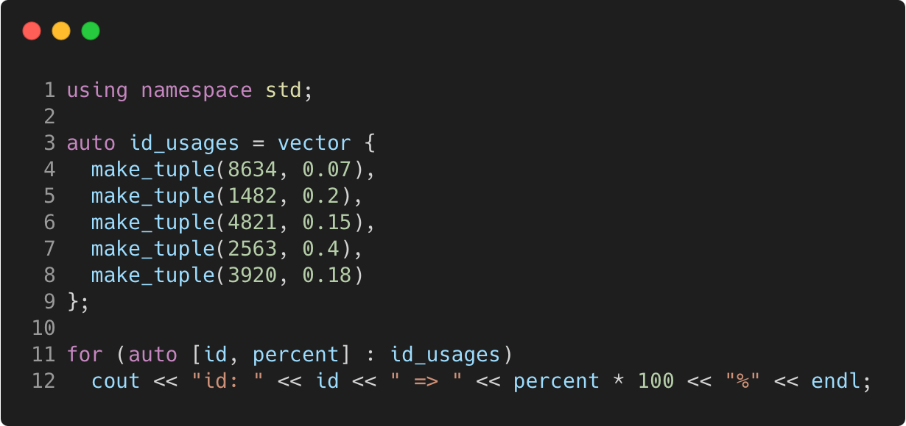

# auto_for_range_loop_with_auto

Modern C++ course `auto_for_range_loop_with_auto` example.



## Source

[auto_for_range_loop_with_auto.cpp](auto_for_range_loop_with_auto.cpp)

[CMakeLists.txt](CMakeLists.txt)

## Output

```
id: 8634 => 7%
id: 1482 => 20%
id: 4821 => 15%
id: 2563 => 40%
id: 3920 => 18%
```

## Build and run

To build `auto_for_range_loop_with_auto` project, open "Terminal" and type following lines:

### Windows :

``` shell
mkdir build && cd build
cmake .. 
start auto_for_range_loop_with_auto.sln
```

Select `auto_for_range_loop_with_auto` project and type Ctrl+F5 to build and run it.

### macOS :

``` shell
mkdir build && cd build
cmake .. -G "Xcode"
open ./auto_for_range_loop_with_auto.xcodeproj
```

Select `auto_for_range_loop_with_auto` project and type Cmd+R to build and run it.

### Linux :

``` shell
mkdir build && cd build
cmake .. 
cmake --build . --config Debug
./auto_for_range_loop_with_auto
```

### Linux with Visual Studio Code :

* Launch Visual Studio Code.
* Select `File/Open Folder...` menu.
* Select `auto_for_range_loop_with_auto` folder and open it.
* Build and Run `auto_for_range_loop_with_auto` project.
