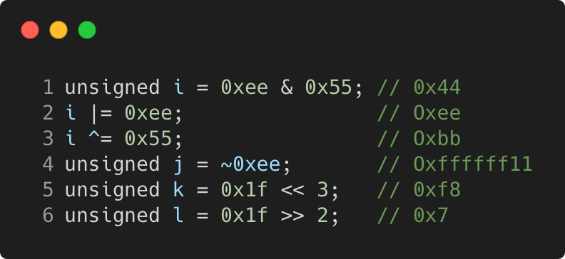

# bitwise_and_assignemnt_operators

Modern C++ course `bitwise_and_assignemnt_operators` example.



## Source

[bitwise_and_assignemnt_operators.cpp](bitwise_and_assignemnt_operators.cpp)

[CMakeLists.txt](CMakeLists.txt)

## Output

```
i = 0xbb, j = 0xffffff11, k = 0xf8, l = 0x7
```

## Build and run

To build `bitwise_and_assignemnt_operators` project, open "Terminal" and type following lines:

### Windows :

``` shell
mkdir build && cd build
cmake .. 
start bitwise_and_assignemnt_operators.sln
```

Select `bitwise_and_assignemnt_operators` project and type Ctrl+F5 to build and run it.

### macOS :

``` shell
mkdir build && cd build
cmake .. -G "Xcode"
open ./bitwise_and_assignemnt_operators.xcodeproj
```

Select `bitwise_and_assignemnt_operators` project and type Cmd+R to build and run it.

### Linux :

``` shell
mkdir build && cd build
cmake .. 
cmake --build . --config Debug
./bitwise_and_assignemnt_operators
```

### Linux with Visual Studio Code :

* Launch Visual Studio Code.
* Select `File/Open Folder...` menu.
* Select `bitwise_and_assignemnt_operators` folder and open it.
* Build and Run `bitwise_and_assignemnt_operators` project.
