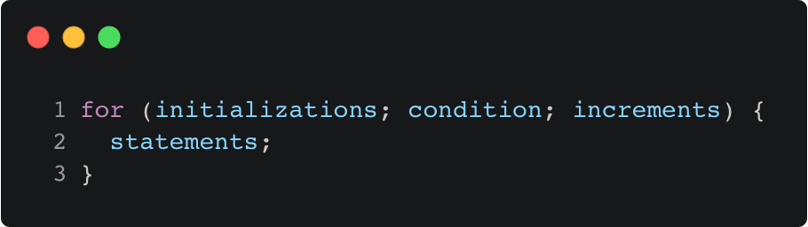

# for_loop_syntax

Modern C++ course `for_loop_syntax` example.



## Source

[for_loop_syntax.cpp](for_loop_syntax.cpp)

[CMakeLists.txt](CMakeLists.txt)

## Output

```
for loop syntax
```

## Build and run

To build `for_loop_syntax` project, open "Terminal" and type following lines:

### Windows :

``` shell
mkdir build && cd build
cmake .. 
start for_loop_syntax.sln
```

Select `for_loop_syntax` project and type Ctrl+F5 to build and run it.

### macOS :

``` shell
mkdir build && cd build
cmake .. -G "Xcode"
open ./for_loop_syntax.xcodeproj
```

Select `for_loop_syntax` project and type Cmd+R to build and run it.

### Linux :

``` shell
mkdir build && cd build
cmake .. 
cmake --build . --config Debug
./for_loop_syntax
```

### Linux with Visual Studio Code :

* Launch Visual Studio Code.
* Select `File/Open Folder...` menu.
* Select `for_loop_syntax` folder and open it.
* Build and Run `for_loop_syntax` project.
