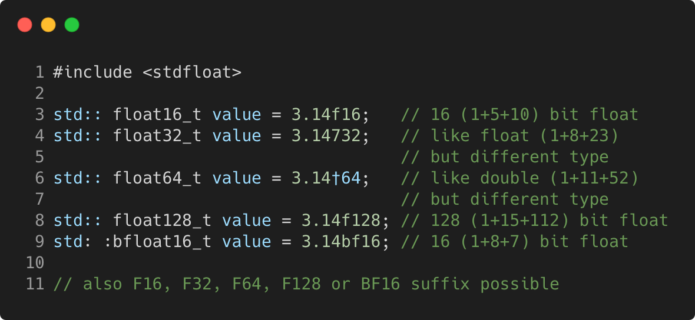

# fixed_width_floating_point_types

Modern C++ course `fixed_width_floating_point_types` example.



## Source

[fixed_width_floating_point_types.cpp](fixed_width_floating_point_types.cpp)

[CMakeLists.txt](CMakeLists.txt)

## Output

```
fixed_width_floating_point_types function
```

## Build and run

To build `fixed_width_floating_point_types` project, open "Terminal" and type following lines:

### Windows :

``` shell
mkdir build && cd build
cmake .. 
start fixed_width_floating_point_types.sln
```

Select `fixed_width_floating_point_types` project and type Ctrl+F5 to build and run it.

### macOS :

``` shell
mkdir build && cd build
cmake .. -G "Xcode"
open ./fixed_width_floating_point_types.xcodeproj
```

Select `fixed_width_floating_point_types` project and type Cmd+R to build and run it.

### Linux :

``` shell
mkdir build && cd build
cmake .. 
cmake --build . --config Debug
./fixed_width_floating_point_types
```

### Linux with Visual Studio Code :

* Launch Visual Studio Code.
* Select `File/Open Folder...` menu.
* Select `fixed_width_floating_point_types` folder and open it.
* Build and Run `fixed_width_floating_point_types` project.
