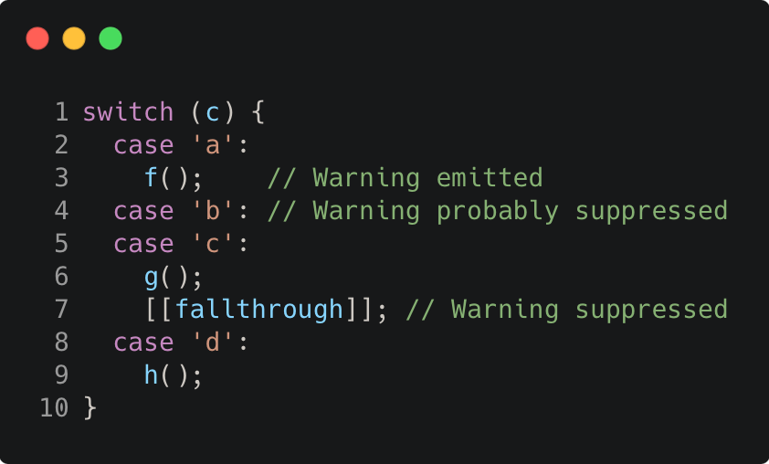

# fallthrough_attribute

Modern C++ course `fallthrough_attribute` example.



## Source

[fallthrough_attribute.cpp](fallthrough_attribute.cpp)

[CMakeLists.txt](CMakeLists.txt)

## Output

```
fallthrough_attribute function
```

## Build and run

To build `fallthrough_attribute` project, open "Terminal" and type following lines:

### Windows :

``` shell
mkdir build && cd build
cmake .. 
start fallthrough_attribute.sln
```

Select `fallthrough_attribute` project and type Ctrl+F5 to build and run it.

### macOS :

``` shell
mkdir build && cd build
cmake .. -G "Xcode"
open ./fallthrough_attribute.xcodeproj
```

Select `fallthrough_attribute` project and type Cmd+R to build and run it.

### Linux :

``` shell
mkdir build && cd build
cmake .. 
cmake --build . --config Debug
./fallthrough_attribute
```

### Linux with Visual Studio Code :

* Launch Visual Studio Code.
* Select `File/Open Folder...` menu.
* Select `fallthrough_attribute` folder and open it.
* Build and Run `fallthrough_attribute` project.
