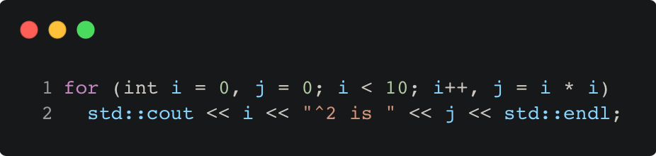

# for_loop_example

Modern C++ course `for_loop_example` example.



## Source

[for_loop_example.cpp](for_loop_example.cpp)

[CMakeLists.txt](CMakeLists.txt)

## Output

```
0^2 is 0
1^2 is 1
2^2 is 4
3^2 is 9
4^2 is 16
5^2 is 25
6^2 is 36
7^2 is 49
8^2 is 64
9^2 is 81
```

## Build and run

To build `for_loop_example` project, open "Terminal" and type following lines:

### Windows :

``` shell
mkdir build && cd build
cmake .. 
start for_loop_example.sln
```

Select `for_loop_example` project and type Ctrl+F5 to build and run it.

### macOS :

``` shell
mkdir build && cd build
cmake .. -G "Xcode"
open ./for_loop_example.xcodeproj
```

Select `for_loop_example` project and type Cmd+R to build and run it.

### Linux :

``` shell
mkdir build && cd build
cmake .. 
cmake --build . --config Debug
./for_loop_example
```

### Linux with Visual Studio Code :

* Launch Visual Studio Code.
* Select `File/Open Folder...` menu.
* Select `for_loop_example` folder and open it.
* Build and Run `for_loop_example` project.
