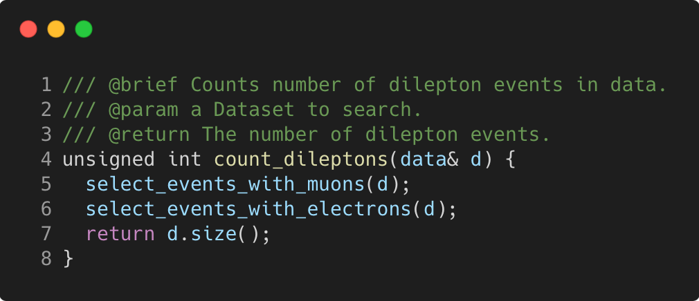

# function_good_practices

Modern C++ course `function_good_practices` example.



## Source

[function_good_practices.cpp](function_good_practices.cpp)

[CMakeLists.txt](CMakeLists.txt)

## Output

```
Good practices
```

## Build and run

To build `function_good_practices` project, open "Terminal" and type following lines:

### Windows :

``` shell
mkdir build && cd build
cmake .. 
start function_good_practices.sln
```

Select `function_good_practices` project and type Ctrl+F5 to build and run it.

### macOS :

``` shell
mkdir build && cd build
cmake .. -G "Xcode"
open ./function_good_practices.xcodeproj
```

Select `function_good_practices` project and type Cmd+R to build and run it.

### Linux :

``` shell
mkdir build && cd build
cmake .. 
cmake --build . --config Debug
./function_good_practices
```

### Linux with Visual Studio Code :

* Launch Visual Studio Code.
* Select `File/Open Folder...` menu.
* Select `function_good_practices` folder and open it.
* Build and Run `function_good_practices` project.
