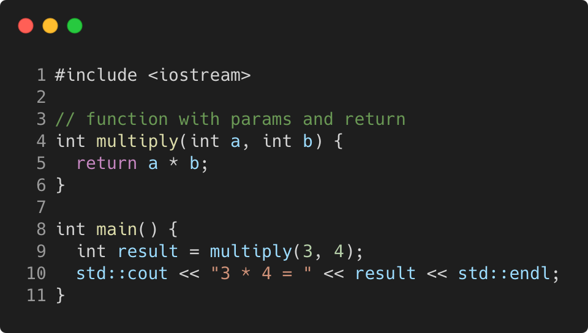

# function_with_params_and_return

Modern C++ course `function_with_params_and_return` example.



## Source

[function_with_params_and_return.cpp](function_with_params_and_return.cpp)

[CMakeLists.txt](CMakeLists.txt)

## Output

```
3 * 4 = 12
```

## Build and run

To build `function_with_params_and_return` project, open "Terminal" and type following lines:

### Windows :

``` shell
mkdir build && cd build
cmake .. 
start function_with_params_and_return.sln
```

Select `function_with_params_and_return` project and type Ctrl+F5 to build and run it.

### macOS :

``` shell
mkdir build && cd build
cmake .. -G "Xcode"
open ./function_with_params_and_return.xcodeproj
```

Select `function_with_params_and_return` project and type Cmd+R to build and run it.

### Linux :

``` shell
mkdir build && cd build
cmake .. 
cmake --build . --config Debug
./function_with_params_and_return
```

### Linux with Visual Studio Code :

* Launch Visual Studio Code.
* Select `File/Open Folder...` menu.
* Select `function_with_params_and_return` folder and open it.
* Build and Run `function_with_params_and_return` project.
