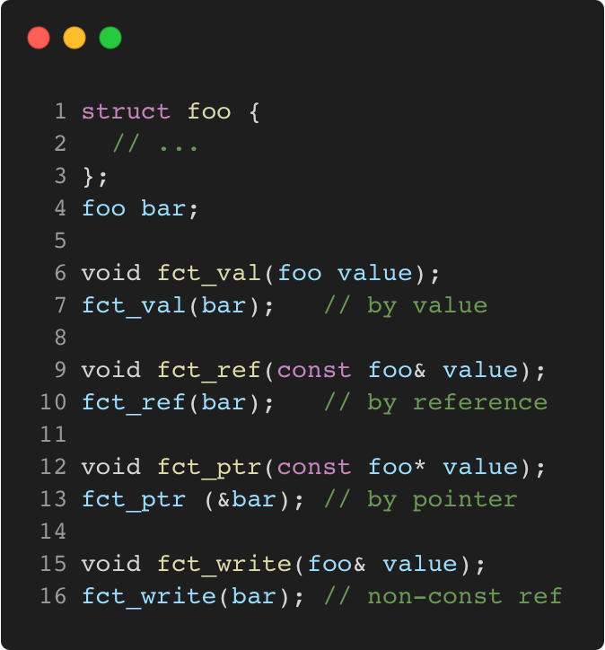

# different_ways_to_pass_arguments_to_a_function

Modern C++ course `different_ways_to_pass_arguments_to_a_function` example.



## Source

[different_ways_to_pass_arguments_to_a_function.cpp](different_ways_to_pass_arguments_to_a_function.cpp)

[CMakeLists.txt](CMakeLists.txt)

## Output

```
Different ways to pass arguments to a function
```

## Build and run

To build `different_ways_to_pass_arguments_to_a_function` project, open "Terminal" and type following lines:

### Windows :

``` shell
mkdir build && cd build
cmake .. 
start different_ways_to_pass_arguments_to_a_function.sln
```

Select `different_ways_to_pass_arguments_to_a_function` project and type Ctrl+F5 to build and run it.

### macOS :

``` shell
mkdir build && cd build
cmake .. -G "Xcode"
open ./different_ways_to_pass_arguments_to_a_function.xcodeproj
```

Select `different_ways_to_pass_arguments_to_a_function` project and type Cmd+R to build and run it.

### Linux :

``` shell
mkdir build && cd build
cmake .. 
cmake --build . --config Debug
./different_ways_to_pass_arguments_to_a_function
```

### Linux with Visual Studio Code :

* Launch Visual Studio Code.
* Select `File/Open Folder...` menu.
* Select `different_ways_to_pass_arguments_to_a_function` folder and open it.
* Build and Run `different_ways_to_pass_arguments_to_a_function` project.
