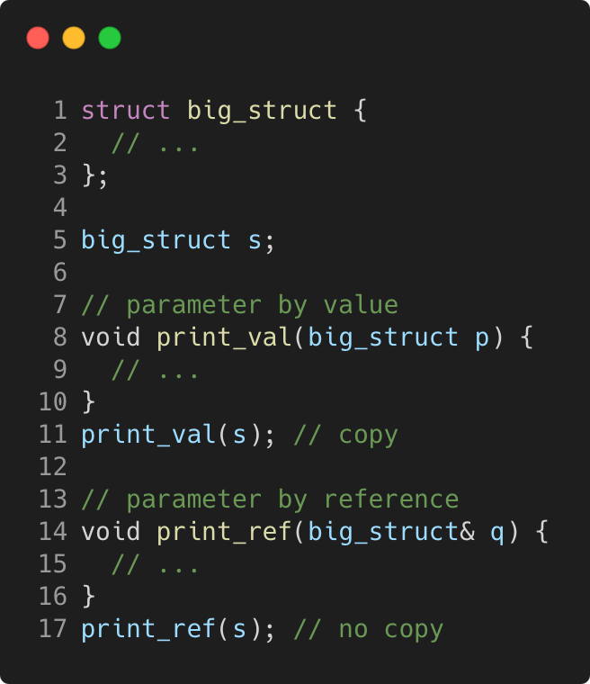

# paramters_are_passed_by_value

Modern C++ course `paramters_are_passed_by_value` example.



## Source

[paramters_are_passed_by_value.cpp](paramters_are_passed_by_value.cpp)

[CMakeLists.txt](CMakeLists.txt)

## Output

```
Paramters are passed by value
```

## Build and run

To build `paramters_are_passed_by_value` project, open "Terminal" and type following lines:

### Windows :

``` shell
mkdir build && cd build
cmake .. 
start paramters_are_passed_by_value.sln
```

Select `paramters_are_passed_by_value` project and type Ctrl+F5 to build and run it.

### macOS :

``` shell
mkdir build && cd build
cmake .. -G "Xcode"
open ./paramters_are_passed_by_value.xcodeproj
```

Select `paramters_are_passed_by_value` project and type Cmd+R to build and run it.

### Linux :

``` shell
mkdir build && cd build
cmake .. 
cmake --build . --config Debug
./paramters_are_passed_by_value
```

### Linux with Visual Studio Code :

* Launch Visual Studio Code.
* Select `File/Open Folder...` menu.
* Select `paramters_are_passed_by_value` folder and open it.
* Build and Run `paramters_are_passed_by_value` project.
