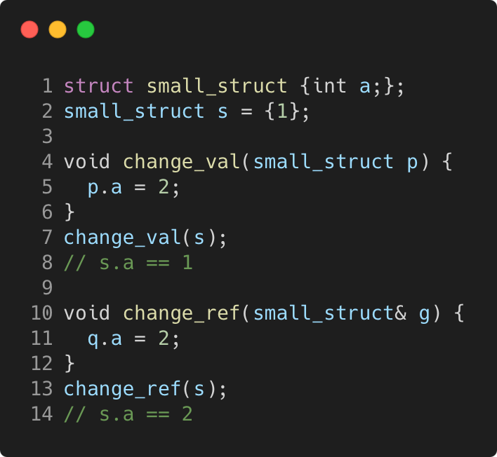

# pass_by_value_or_reference

Modern C++ course `pass_by_value_or_reference` example.



## Source

[pass_by_value_or_reference.cpp](pass_by_value_or_reference.cpp)

[CMakeLists.txt](CMakeLists.txt)

## Output

```
Pass by value or reference
```

## Build and run

To build `pass_by_value_or_reference` project, open "Terminal" and type following lines:

### Windows :

``` shell
mkdir build && cd build
cmake .. 
start pass_by_value_or_reference.sln
```

Select `pass_by_value_or_reference` project and type Ctrl+F5 to build and run it.

### macOS :

``` shell
mkdir build && cd build
cmake .. -G "Xcode"
open ./pass_by_value_or_reference.xcodeproj
```

Select `pass_by_value_or_reference` project and type Cmd+R to build and run it.

### Linux :

``` shell
mkdir build && cd build
cmake .. 
cmake --build . --config Debug
./pass_by_value_or_reference
```

### Linux with Visual Studio Code :

* Launch Visual Studio Code.
* Select `File/Open Folder...` menu.
* Select `pass_by_value_or_reference` folder and open it.
* Build and Run `pass_by_value_or_reference` project.
