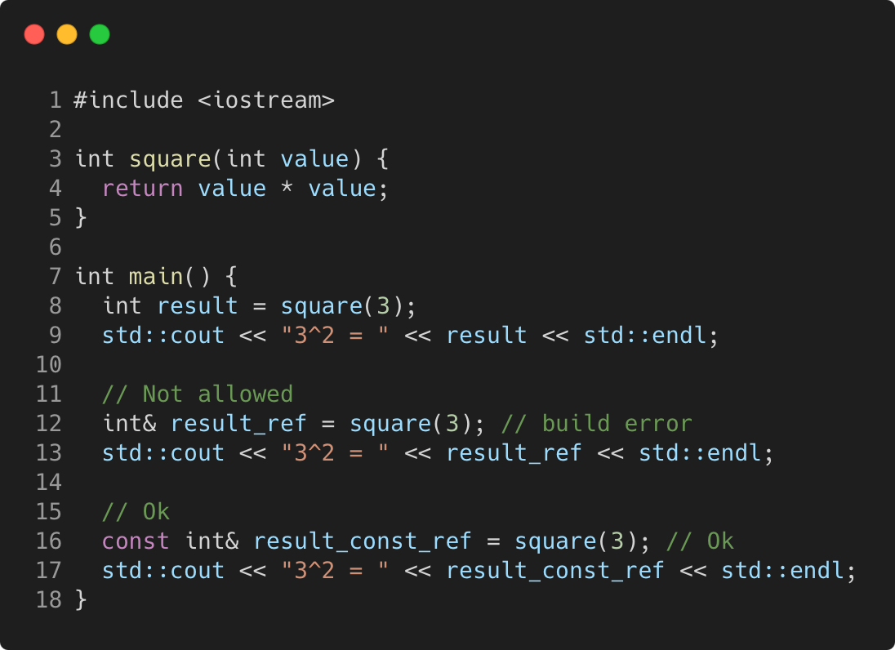

# functions_and_references_to_returned_values

Modern C++ course `functions_and_references_to_returned_values` example.



## Source

[functions_and_references_to_returned_values.cpp](functions_and_references_to_returned_values.cpp)

[CMakeLists.txt](CMakeLists.txt)

## Output

```
functions_and_references_to_returned_values function
```

## Build and run

To build `functions_and_references_to_returned_values` project, open "Terminal" and type following lines:

### Windows :

``` shell
mkdir build && cd build
cmake .. 
start functions_and_references_to_returned_values.sln
```

Select `functions_and_references_to_returned_values` project and type Ctrl+F5 to build and run it.

### macOS :

``` shell
mkdir build && cd build
cmake .. -G "Xcode"
open ./functions_and_references_to_returned_values.xcodeproj
```

Select `functions_and_references_to_returned_values` project and type Cmd+R to build and run it.

### Linux :

``` shell
mkdir build && cd build
cmake .. 
cmake --build . --config Debug
./functions_and_references_to_returned_values
```

### Linux with Visual Studio Code :

* Launch Visual Studio Code.
* Select `File/Open Folder...` menu.
* Select `functions_and_references_to_returned_values` folder and open it.
* Build and Run `functions_and_references_to_returned_values` project.
