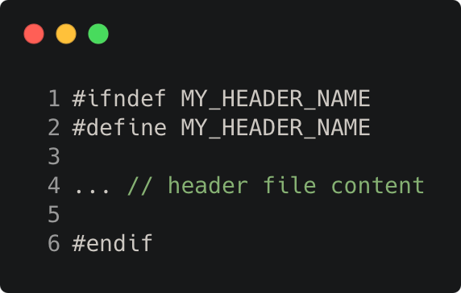

# header_include_guards

Modern C++ course `header_include_guards` example.



## Source

[header_include_guards.hpp](header_include_guards.hpp)

[header_include_guards_2.hpp](header_include_guards_2.hpp)

[header_include_guards.cpp](header_include_guards.cpp)

[CMakeLists.txt](CMakeLists.txt)

## Output

```
my_value       = 456
my_other_value = 789
```

## Build and run

To build `header_include_guards` project, open "Terminal" and type following lines:

### Windows :

``` shell
mkdir build && cd build
cmake .. 
start header_include_guards.sln
```

Select `header_include_guards` project and type Ctrl+F5 to build and run it.

### macOS :

``` shell
mkdir build && cd build
cmake .. -G "Xcode"
open ./header_include_guards.xcodeproj
```

Select `header_include_guards` project and type Cmd+R to build and run it.

### Linux :

``` shell
mkdir build && cd build
cmake .. 
cmake --build . --config Debug
./header_include_guards
```

### Linux with Visual Studio Code :

* Launch Visual Studio Code.
* Select `File/Open Folder...` menu.
* Select `header_include_guards` folder and open it.
* Build and Run `header_include_guards` project.
