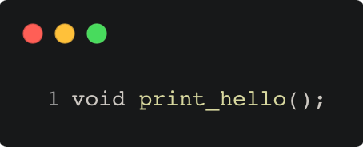
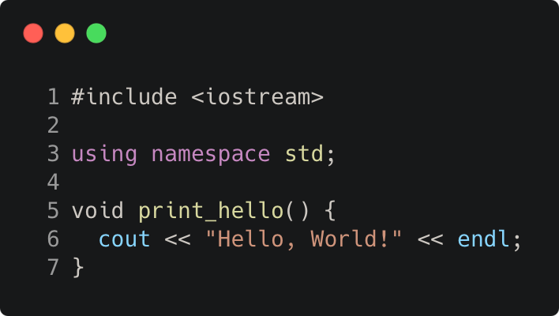
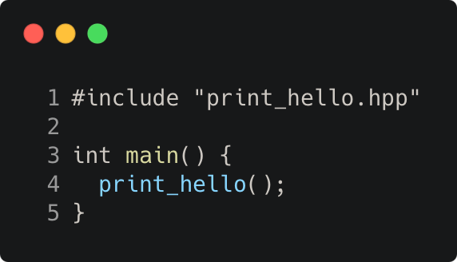

# headers_and_interfaces_print_hello

Modern C++ course `headers_and_interfaces_print_hello` example.







## Source

* [print_hello.hpp](print_hello.hpp)
* [print_hello.cpp](print_hello.cpp)
* [main.cpp](main.cpp)
* [CMakeLists.txt](CMakeLists.txt)

## Output

```
Hello, World!
```

## Build and run

To build `headers_and_interfaces_print_hello` project, open "Terminal" and type following lines:

### Windows :

``` shell
mkdir build && cd build
cmake .. 
start headers_and_interfaces_print_hello.sln
```

Select `headers_and_interfaces_print_hello` project and type Ctrl+F5 to build and run it.

### macOS :

``` shell
mkdir build && cd build
cmake .. -G "Xcode"
open ./headers_and_interfaces_print_hello.xcodeproj
```

Select `headers_and_interfaces_print_hello` project and type Cmd+R to build and run it.

### Linux :

``` shell
mkdir build && cd build
cmake .. 
cmake --build . --config Debug
./headers_and_interfaces_print_hello
```

### Linux with Visual Studio Code :

* Launch Visual Studio Code.
* Select `File/Open Folder...` menu.
* Select `headers_and_interfaces_print_hello` folder and open it.
* Build and Run `headers_and_interfaces_print_hello` project.
