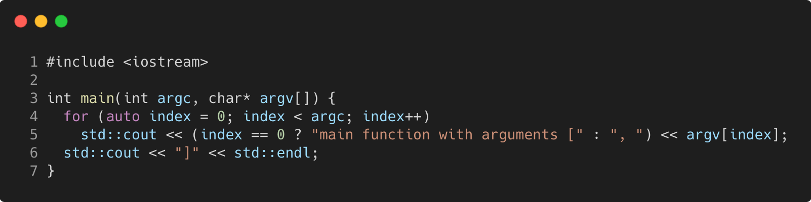

# main_with_arguments

Modern C++ course `main_with_arguments` example.



## Source

[main.cpp](main_with_arguments.cpp)

[CMakeLists.txt](CMakeLists.txt)

## Output

```
main function with arguments [./main_with_arguments, arg1, arg2, arg3]
```

## Build and run

To build `main_with_arguments` project, open "Terminal" and type following lines:

### Windows :

``` shell
mkdir build && cd build
cmake .. 
start main_with_arguments.sln
```

Select `main_with_arguments` project and type Ctrl+F5 to build and run it.

### macOS :

``` shell
mkdir build && cd build
cmake .. -G "Xcode"
open ./main_with_arguments.xcodeproj
```

Select `main_with_arguments` project and type Cmd+R to build and run it.

### Linux :

``` shell
mkdir build && cd build
cmake .. 
cmake --build . --config Debug
./main_with_arguments
```

### Linux with Visual Studio Code :

* Launch Visual Studio Code.
* Select `File/Open Folder...` menu.
* Select `main_with_arguments` folder and open it.
* Build and Run `main_with_arguments` project.
