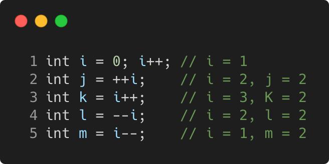

# increment_decrement_operators

Modern C++ course `increment_decrement_operators` example.



## Source

[increment_decrement_operators.cpp](increment_decrement_operators.cpp)

[CMakeLists.txt](CMakeLists.txt)

## Output

```
i = 1, j = 2, k = 2, l = 2, m = 2
```

## Build and run

To build `increment_decrement_operators` project, open "Terminal" and type following lines:

### Windows :

``` shell
mkdir build && cd build
cmake .. 
start increment_decrement_operators.sln
```

Select `increment_decrement_operators` project and type Ctrl+F5 to build and run it.

### macOS :

``` shell
mkdir build && cd build
cmake .. -G "Xcode"
open ./increment_decrement_operators.xcodeproj
```

Select `increment_decrement_operators` project and type Cmd+R to build and run it.

### Linux :

``` shell
mkdir build && cd build
cmake .. 
cmake --build . --config Debug
./increment_decrement_operators
```

### Linux with Visual Studio Code :

* Launch Visual Studio Code.
* Select `File/Open Folder...` menu.
* Select `increment_decrement_operators` folder and open it.
* Build and Run `increment_decrement_operators` project.
