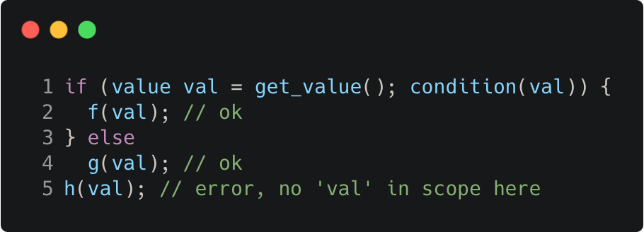

# init_statement_for_if_and_switch

Modern C++ course `init_statement_for_if_and_switch` example.



## Source

[init_statement_for_if_and_switch.cpp](init_statement_for_if_and_switch.cpp)

[CMakeLists.txt](CMakeLists.txt)

## Output

```
(f) val = 42
```

## Build and run

To build `init_statement_for_if_and_switch` project, open "Terminal" and type following lines:

### Windows :

``` shell
mkdir build && cd build
cmake .. 
start init_statement_for_if_and_switch.sln
```

Select `init_statement_for_if_and_switch` project and type Ctrl+F5 to build and run it.

### macOS :

``` shell
mkdir build && cd build
cmake .. -G "Xcode"
open ./init_statement_for_if_and_switch.xcodeproj
```

Select `init_statement_for_if_and_switch` project and type Cmd+R to build and run it.

### Linux :

``` shell
mkdir build && cd build
cmake .. 
cmake --build . --config Debug
./init_statement_for_if_and_switch
```

### Linux with Visual Studio Code :

* Launch Visual Studio Code.
* Select `File/Open Folder...` menu.
* Select `init_statement_for_if_and_switch` folder and open it.
* Build and Run `init_statement_for_if_and_switch` project.
