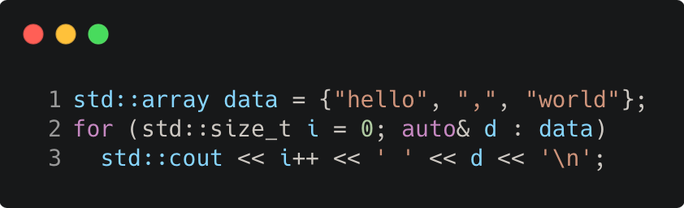

# init_statements_for_range_based_loop

Modern C++ course `init_statements_for_range_based_loop` example.



## Source

[init_statements_for_range_based_loop.cpp](init_statements_for_range_based_loop.cpp)

[CMakeLists.txt](CMakeLists.txt)

## Output

```
0 hello
1 ,
2 world
```

## Build and run

To build `init_statements_for_range_based_loop` project, open "Terminal" and type following lines:

### Windows :

``` shell
mkdir build && cd build
cmake .. 
start init_statements_for_range_based_loop.sln
```

Select `init_statements_for_range_based_loop` project and type Ctrl+F5 to build and run it.

### macOS :

``` shell
mkdir build && cd build
cmake .. -G "Xcode"
open ./init_statements_for_range_based_loop.xcodeproj
```

Select `init_statements_for_range_based_loop` project and type Cmd+R to build and run it.

### Linux :

``` shell
mkdir build && cd build
cmake .. 
cmake --build . --config Debug
./init_statements_for_range_based_loop
```

### Linux with Visual Studio Code :

* Launch Visual Studio Code.
* Select `File/Open Folder...` menu.
* Select `init_statements_for_range_based_loop` folder and open it.
* Build and Run `init_statements_for_range_based_loop` project.
