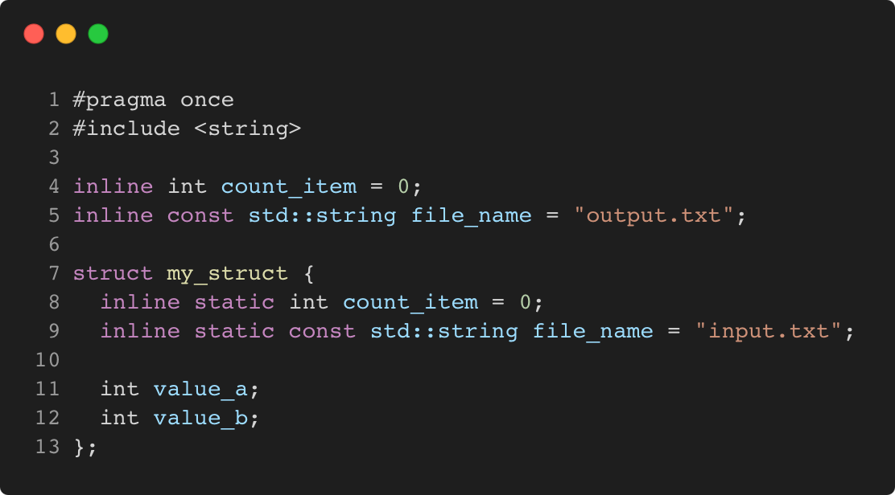
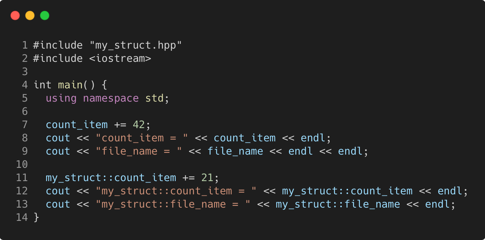

# inline_variables

Modern C++ course `inline_variables` example.




## Source

[my_struct.hpp](my_struct.hpp)

[inline_variables.cpp](inline_variables.cpp)

[CMakeLists.txt](CMakeLists.txt)

## Output

```
count_item = 42
file_name = output.txt

my_struct::count_item = 21
my_struct::file_name = input.txt
```

## Build and run

To build `inline_variables` project, open "Terminal" and type following lines:

### Windows :

``` shell
mkdir build && cd build
cmake .. 
start inline_variables.sln
```

Select `inline_variables` project and type Ctrl+F5 to build and run it.

### macOS :

``` shell
mkdir build && cd build
cmake .. -G "Xcode"
open ./inline_variables.xcodeproj
```

Select `inline_variables` project and type Cmd+R to build and run it.

### Linux :

``` shell
mkdir build && cd build
cmake .. 
cmake --build . --config Debug
./inline_variables
```

### Linux with Visual Studio Code :

* Launch Visual Studio Code.
* Select `File/Open Folder...` menu.
* Select `inline_variables` folder and open it.
* Build and Run `inline_variables` project.
