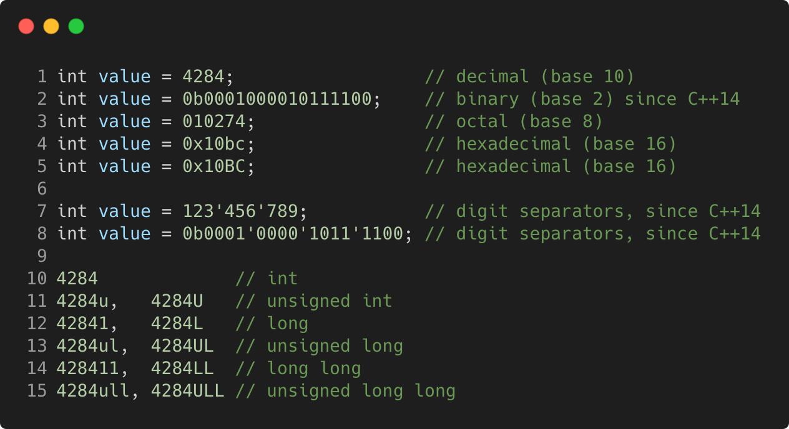

# integer_literals

Modern C++ course `integer_literals` example.



## Source

[integer_literals.cpp](integer_literals.cpp)

[CMakeLists.txt](CMakeLists.txt)

## Output

```
integer_literals function
```

## Build and run

To build `integer_literals` project, open "Terminal" and type following lines:

### Windows :

``` shell
mkdir build && cd build
cmake .. 
start integer_literals.sln
```

Select `integer_literals` project and type Ctrl+F5 to build and run it.

### macOS :

``` shell
mkdir build && cd build
cmake .. -G "Xcode"
open ./integer_literals.xcodeproj
```

Select `integer_literals` project and type Cmd+R to build and run it.

### Linux :

``` shell
mkdir build && cd build
cmake .. 
cmake --build . --config Debug
./integer_literals
```

### Linux with Visual Studio Code :

* Launch Visual Studio Code.
* Select `File/Open Folder...` menu.
* Select `integer_literals` folder and open it.
* Build and Run `integer_literals` project.
