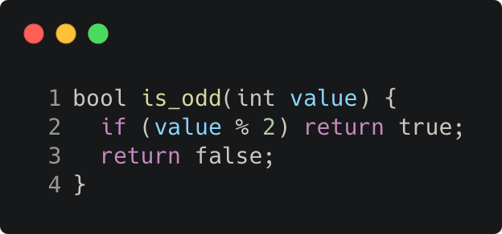

# jump_statement_return_2

Modern C++ course `jump_statement_return_2` example.



## Source

[jump_statement_return_2.cpp](jump_statement_return_2.cpp)

[CMakeLists.txt](CMakeLists.txt)

## Output

```
42 is not odd.
21 is odd.
```

## Build and run

To build `jump_statement_return_2` project, open "Terminal" and type following lines:

### Windows :

``` shell
mkdir build && cd build
cmake .. 
start jump_statement_return_2.sln
```

Select `jump_statement_return_2` project and type Ctrl+F5 to build and run it.

### macOS :

``` shell
mkdir build && cd build
cmake .. -G "Xcode"
open ./jump_statement_return_2.xcodeproj
```

Select `jump_statement_return_2` project and type Cmd+R to build and run it.

### Linux :

``` shell
mkdir build && cd build
cmake .. 
cmake --build . --config Debug
./jump_statement_return_2
```

### Linux with Visual Studio Code :

* Launch Visual Studio Code.
* Select `File/Open Folder...` menu.
* Select `jump_statement_return_2` folder and open it.
* Build and Run `jump_statement_return_2` project.
