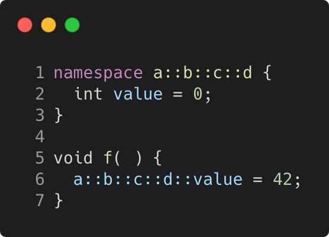

# namespace_alias_nested_namespaces

Modern C++ course `namespace_alias_nested_namespaces` example.



## Source

[namespace_alias_nested_namespaces.cpp](namespace_alias_nested_namespaces.cpp)

[CMakeLists.txt](CMakeLists.txt)

## Output

```
namespace_alias_nested_namespaces function
```

## Build and run

To build `namespace_alias_nested_namespaces` project, open "Terminal" and type following lines:

### Windows :

``` shell
mkdir build && cd build
cmake .. 
start namespace_alias_nested_namespaces.sln
```

Select `namespace_alias_nested_namespaces` project and type Ctrl+F5 to build and run it.

### macOS :

``` shell
mkdir build && cd build
cmake .. -G "Xcode"
open ./namespace_alias_nested_namespaces.xcodeproj
```

Select `namespace_alias_nested_namespaces` project and type Cmd+R to build and run it.

### Linux :

``` shell
mkdir build && cd build
cmake .. 
cmake --build . --config Debug
./namespace_alias_nested_namespaces
```

### Linux with Visual Studio Code :

* Launch Visual Studio Code.
* Select `File/Open Folder...` menu.
* Select `namespace_alias_nested_namespaces` folder and open it.
* Build and Run `namespace_alias_nested_namespaces` project.
