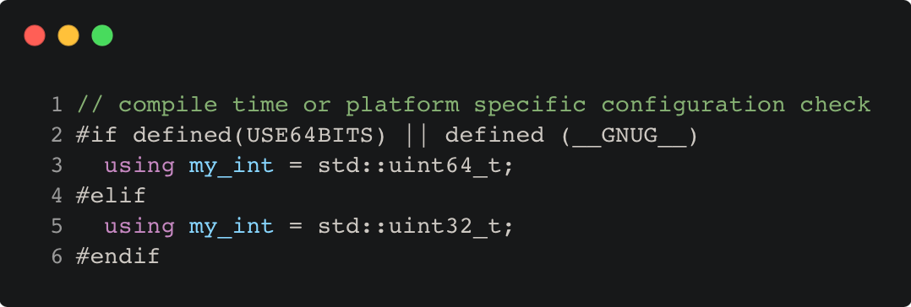

# preprocessor_check

Modern C++ course `preprocessor_check` example.



## Source

[preprocessor_check.cpp](preprocessor_check.cpp)

[CMakeLists.txt](CMakeLists.txt)

## Output

```
sizeof(my_int) = 8
```

## Build and run

To build `preprocessor_check` project, open "Terminal" and type following lines:

### Windows :

``` shell
mkdir build && cd build
cmake .. 
start preprocessor_check.sln
```

Select `preprocessor_check` project and type Ctrl+F5 to build and run it.

### macOS :

``` shell
mkdir build && cd build
cmake .. -G "Xcode"
open ./preprocessor_check.xcodeproj
```

Select `preprocessor_check` project and type Cmd+R to build and run it.

### Linux :

``` shell
mkdir build && cd build
cmake .. 
cmake --build . --config Debug
./preprocessor_check
```

### Linux with Visual Studio Code :

* Launch Visual Studio Code.
* Select `File/Open Folder...` menu.
* Select `preprocessor_check` folder and open it.
* Build and Run `preprocessor_check` project.
