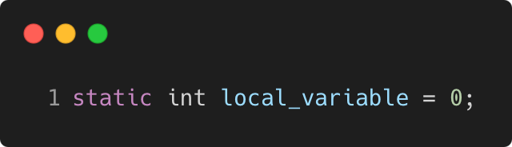

# anonymous_namespace_static

Modern C++ course `anonymous_namespace_static` example.



## Source

[anonymous_namespace_static.cpp](anonymous_namespace_static.cpp)

[CMakeLists.txt](CMakeLists.txt)

## Output

```
anonymous_namespace_static function
```

## Build and run

To build `anonymous_namespace_static` project, open "Terminal" and type following lines:

### Windows :

``` shell
mkdir build && cd build
cmake .. 
start anonymous_namespace_static.sln
```

Select `anonymous_namespace_static` project and type Ctrl+F5 to build and run it.

### macOS :

``` shell
mkdir build && cd build
cmake .. -G "Xcode"
open ./anonymous_namespace_static.xcodeproj
```

Select `anonymous_namespace_static` project and type Cmd+R to build and run it.

### Linux :

``` shell
mkdir build && cd build
cmake .. 
cmake --build . --config Debug
./anonymous_namespace_static
```

### Linux with Visual Studio Code :

* Launch Visual Studio Code.
* Select `File/Open Folder...` menu.
* Select `anonymous_namespace_static` folder and open it.
* Build and Run `anonymous_namespace_static` project.
