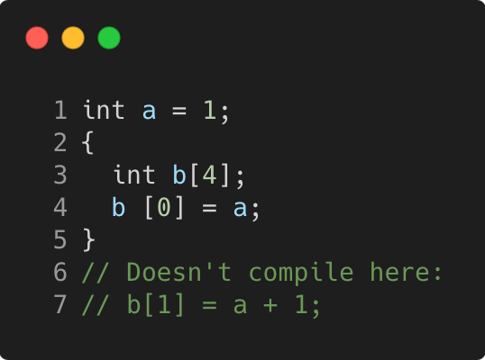

# scope_and_lifetime_of_variables

Modern C++ course `scope_and_lifetime_of_variables` example.



## Source

[scope_and_lifetime_of_variables.cpp](scope_and_lifetime_of_variables.cpp)

[CMakeLists.txt](CMakeLists.txt)

## Output

```
scope_and_lifetime_of_variables function
```

## Build and run

To build `scope_and_lifetime_of_variables` project, open "Terminal" and type following lines:

### Windows :

``` shell
mkdir build && cd build
cmake .. 
start scope_and_lifetime_of_variables.sln
```

Select `scope_and_lifetime_of_variables` project and type Ctrl+F5 to build and run it.

### macOS :

``` shell
mkdir build && cd build
cmake .. -G "Xcode"
open ./scope_and_lifetime_of_variables.xcodeproj
```

Select `scope_and_lifetime_of_variables` project and type Cmd+R to build and run it.

### Linux :

``` shell
mkdir build && cd build
cmake .. 
cmake --build . --config Debug
./scope_and_lifetime_of_variables
```

### Linux with Visual Studio Code :

* Launch Visual Studio Code.
* Select `File/Open Folder...` menu.
* Select `scope_and_lifetime_of_variables` folder and open it.
* Build and Run `scope_and_lifetime_of_variables` project.
