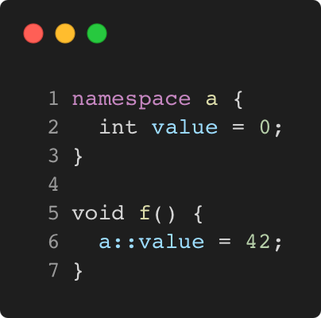

# using_namepsace_directive

Modern C++ course `using_namepsace_directive` example.



## Source

[using_namepsace_directive.cpp](using_namepsace_directive.cpp)

[CMakeLists.txt](CMakeLists.txt)

## Output

```
using_namepsace_directive function
```

## Build and run

To build `using_namepsace_directive` project, open "Terminal" and type following lines:

### Windows :

``` shell
mkdir build && cd build
cmake .. 
start using_namepsace_directive.sln
```

Select `using_namepsace_directive` project and type Ctrl+F5 to build and run it.

### macOS :

``` shell
mkdir build && cd build
cmake .. -G "Xcode"
open ./using_namepsace_directive.xcodeproj
```

Select `using_namepsace_directive` project and type Cmd+R to build and run it.

### Linux :

``` shell
mkdir build && cd build
cmake .. 
cmake --build . --config Debug
./using_namepsace_directive
```

### Linux with Visual Studio Code :

* Launch Visual Studio Code.
* Select `File/Open Folder...` menu.
* Select `using_namepsace_directive` folder and open it.
* Build and Run `using_namepsace_directive` project.
