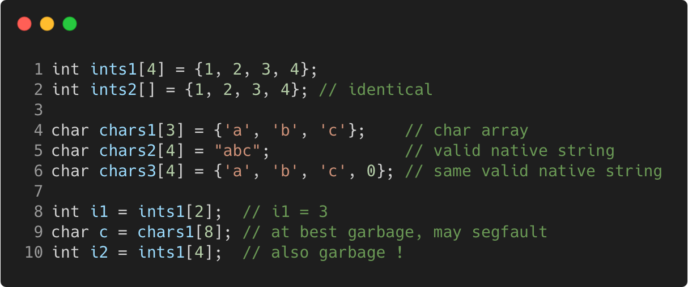

# static_arrays

Modern C++ course `static_arrays` example.



## Source

[static_arrays.cpp](static_arrays.cpp)

[CMakeLists.txt](CMakeLists.txt)

## Output

```
static_arrays function
```

## Build and run

To build `static_arrays` project, open "Terminal" and type following lines:

### Windows :

``` shell
mkdir build && cd build
cmake .. 
start static_arrays.sln
```

Select `static_arrays` project and type Ctrl+F5 to build and run it.

### macOS :

``` shell
mkdir build && cd build
cmake .. -G "Xcode"
open ./static_arrays.xcodeproj
```

Select `static_arrays` project and type Cmd+R to build and run it.

### Linux :

``` shell
mkdir build && cd build
cmake .. 
cmake --build . --config Debug
./static_arrays
```

### Linux with Visual Studio Code :

* Launch Visual Studio Code.
* Select `File/Open Folder...` menu.
* Select `static_arrays` folder and open it.
* Build and Run `static_arrays` project.
