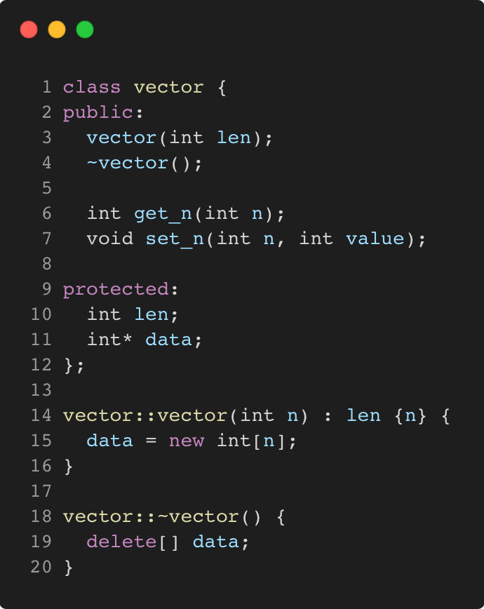

# class_cconstructors_and_destructors_vector

Modern C++ course `class_cconstructors_and_destructors_vector` example.



## Source

[class_cconstructors_and_destructors_vector.cpp](class_cconstructors_and_destructors_vector.cpp)

[CMakeLists.txt](CMakeLists.txt)

## Output

```
reslt = 40
```

## Build and run

To build `class_cconstructors_and_destructors_vector` project, open "Terminal" and type following lines:

### Windows :

``` shell
mkdir build && cd build
cmake .. 
start class_cconstructors_and_destructors_vector.sln
```

Select `class_cconstructors_and_destructors_vector` project and type Ctrl+F5 to build and run it.

### macOS :

``` shell
mkdir build && cd build
cmake .. -G "Xcode"
open ./class_cconstructors_and_destructors_vector.xcodeproj
```

Select `class_cconstructors_and_destructors_vector` project and type Cmd+R to build and run it.

### Linux :

``` shell
mkdir build && cd build
cmake .. 
cmake --build . --config Debug
./class_cconstructors_and_destructors_vector
```

### Linux with Visual Studio Code :

* Launch Visual Studio Code.
* Select `File/Open Folder...` menu.
* Select `class_cconstructors_and_destructors_vector` folder and open it.
* Build and Run `class_cconstructors_and_destructors_vector` project.
