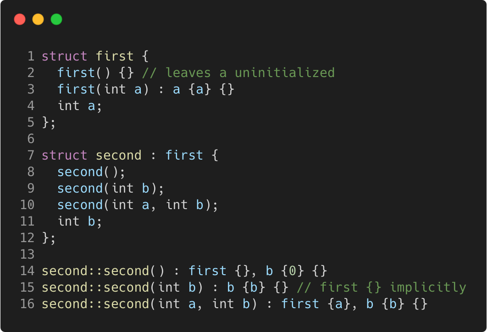

# constructors_and_inheritance

Modern C++ course `constructors_and_inheritance` example.



## Source

[constructors_and_inheritance.cpp](constructors_and_inheritance.cpp)

[CMakeLists.txt](CMakeLists.txt)

## Output

```
s1.a = 86589520, s1.b = 0
s2.a = 86589600, s2.b = 20
s3.a = 10, s3.b = 20
```

## Build and run

To build `constructors_and_inheritance` project, open "Terminal" and type following lines:

### Windows :

``` shell
mkdir build && cd build
cmake .. 
start constructors_and_inheritance.sln
```

Select `constructors_and_inheritance` project and type Ctrl+F5 to build and run it.

### macOS :

``` shell
mkdir build && cd build
cmake .. -G "Xcode"
open ./constructors_and_inheritance.xcodeproj
```

Select `constructors_and_inheritance` project and type Cmd+R to build and run it.

### Linux :

``` shell
mkdir build && cd build
cmake .. 
cmake --build . --config Debug
./constructors_and_inheritance
```

### Linux with Visual Studio Code :

* Launch Visual Studio Code.
* Select `File/Open Folder...` menu.
* Select `constructors_and_inheritance` folder and open it.
* Build and Run `constructors_and_inheritance` project.
