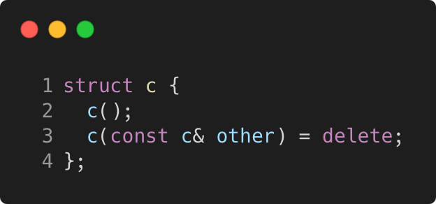

# copy_constructor_forbiden

Modern C++ course `copy_constructor_forbiden` example.



## Source

[copy_constructor_forbiden.cpp](copy_constructor_forbiden.cpp)

[CMakeLists.txt](CMakeLists.txt)

## Output

```
c1.a = 5
```

## Build and run

To build `copy_constructor_forbiden` project, open "Terminal" and type following lines:

### Windows :

``` shell
mkdir build && cd build
cmake .. 
start copy_constructor_forbiden.sln
```

Select `copy_constructor_forbiden` project and type Ctrl+F5 to build and run it.

### macOS :

``` shell
mkdir build && cd build
cmake .. -G "Xcode"
open ./copy_constructor_forbiden.xcodeproj
```

Select `copy_constructor_forbiden` project and type Cmd+R to build and run it.

### Linux :

``` shell
mkdir build && cd build
cmake .. 
cmake --build . --config Debug
./copy_constructor_forbiden
```

### Linux with Visual Studio Code :

* Launch Visual Studio Code.
* Select `File/Open Folder...` menu.
* Select `copy_constructor_forbiden` folder and open it.
* Build and Run `copy_constructor_forbiden` project.
