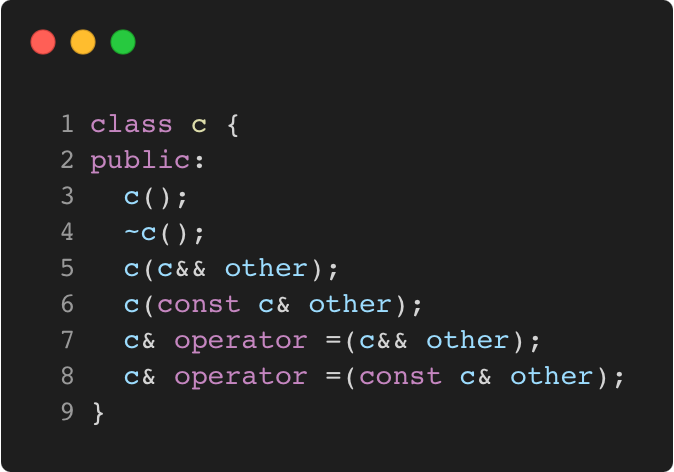

# copy_constructor_rule_of_5

Modern C++ course `copy_constructor_rule_of_5` example.



## Source

[copy_constructor_rule_of_5.cpp](copy_constructor_rule_of_5.cpp)

[CMakeLists.txt](CMakeLists.txt)

## Output

```
c1.value = 10
c2.value = 10
```

## Build and run

To build `copy_constructor_rule_of_5` project, open "Terminal" and type following lines:

### Windows :

``` shell
mkdir build && cd build
cmake .. 
start copy_constructor_rule_of_5.sln
```

Select `copy_constructor_rule_of_5` project and type Ctrl+F5 to build and run it.

### macOS :

``` shell
mkdir build && cd build
cmake .. -G "Xcode"
open ./copy_constructor_rule_of_5.xcodeproj
```

Select `copy_constructor_rule_of_5` project and type Cmd+R to build and run it.

### Linux :

``` shell
mkdir build && cd build
cmake .. 
cmake --build . --config Debug
./copy_constructor_rule_of_5
```

### Linux with Visual Studio Code :

* Launch Visual Studio Code.
* Select `File/Open Folder...` menu.
* Select `copy_constructor_rule_of_5` folder and open it.
* Build and Run `copy_constructor_rule_of_5` project.
