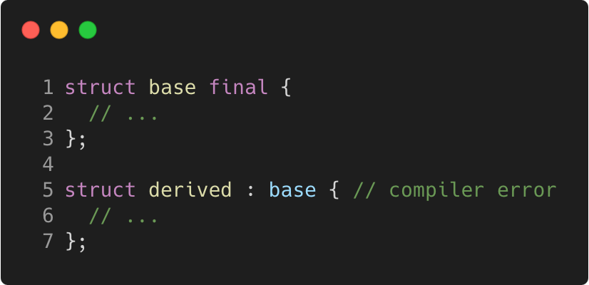

# final_class

Modern C++ course `final_class` example.



## Source

[final_class.cpp](final_class.cpp)

[CMakeLists.txt](CMakeLists.txt)

## Output

```
Final class
```

## Build and run

To build `final_class` project, open "Terminal" and type following lines:

### Windows :

``` shell
mkdir build && cd build
cmake .. 
start final_class.sln
```

Select `final_class` project and type Ctrl+F5 to build and run it.

### macOS :

``` shell
mkdir build && cd build
cmake .. -G "Xcode"
open ./final_class.xcodeproj
```

Select `final_class` project and type Cmd+R to build and run it.

### Linux :

``` shell
mkdir build && cd build
cmake .. 
cmake --build . --config Debug
./final_class
```

### Linux with Visual Studio Code :

* Launch Visual Studio Code.
* Select `File/Open Folder...` menu.
* Select `final_class` folder and open it.
* Build and Run `final_class` project.
