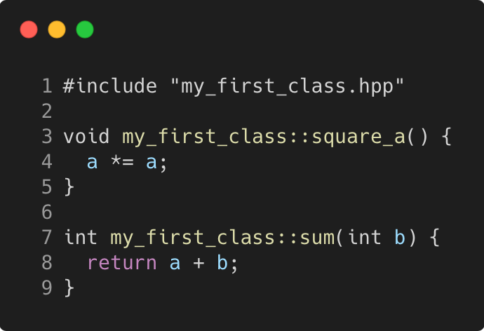

# implementing_methods

Modern C++ course `implementing_methods` example.



## Source

[implementing_methods.cpp](implementing_methods.cpp)

[CMakeLists.txt](CMakeLists.txt)

## Output

```
my_obj.a = 4
```

## Build and run

To build `implementing_methods` project, open "Terminal" and type following lines:

### Windows :

``` shell
mkdir build && cd build
cmake .. 
start implementing_methods.sln
```

Select `implementing_methods` project and type Ctrl+F5 to build and run it.

### macOS :

``` shell
mkdir build && cd build
cmake .. -G "Xcode"
open ./implementing_methods.xcodeproj
```

Select `implementing_methods` project and type Cmd+R to build and run it.

### Linux :

``` shell
mkdir build && cd build
cmake .. 
cmake --build . --config Debug
./implementing_methods
```

### Linux with Visual Studio Code :

* Launch Visual Studio Code.
* Select `File/Open Folder...` menu.
* Select `implementing_methods` folder and open it.
* Build and Run `implementing_methods` project.
