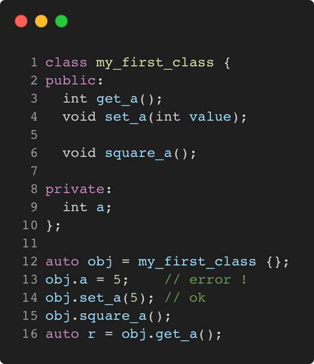

# managing_access_to_class_members

Modern C++ course `managing_access_to_class_members` example.



## Source

[managing_access_to_class_members.cpp](managing_access_to_class_members.cpp)

[CMakeLists.txt](CMakeLists.txt)

## Output

```
r = 25
```

## Build and run

To build `managing_access_to_class_members` project, open "Terminal" and type following lines:

### Windows :

``` shell
mkdir build && cd build
cmake .. 
start managing_access_to_class_members.sln
```

Select `managing_access_to_class_members` project and type Ctrl+F5 to build and run it.

### macOS :

``` shell
mkdir build && cd build
cmake .. -G "Xcode"
open ./managing_access_to_class_members.xcodeproj
```

Select `managing_access_to_class_members` project and type Cmd+R to build and run it.

### Linux :

``` shell
mkdir build && cd build
cmake .. 
cmake --build . --config Debug
./managing_access_to_class_members
```

### Linux with Visual Studio Code :

* Launch Visual Studio Code.
* Select `File/Open Folder...` menu.
* Select `managing_access_to_class_members` folder and open it.
* Build and Run `managing_access_to_class_members` project.
