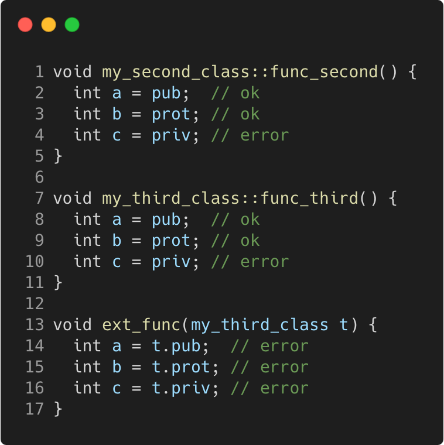

# managing_inheritance_privacy_protected

Modern C++ course `managing_inheritance_privacy_protected` example.



## Source

[managing_inheritance_privacy_protected.cpp](managing_inheritance_privacy_protected.cpp)

[CMakeLists.txt](CMakeLists.txt)

## Output

```
Managing inheritance privacy - protected
```

## Build and run

To build `managing_inheritance_privacy_protected` project, open "Terminal" and type following lines:

### Windows :

``` shell
mkdir build && cd build
cmake .. 
start managing_inheritance_privacy_protected.sln
```

Select `managing_inheritance_privacy_protected` project and type Ctrl+F5 to build and run it.

### macOS :

``` shell
mkdir build && cd build
cmake .. -G "Xcode"
open ./managing_inheritance_privacy_protected.xcodeproj
```

Select `managing_inheritance_privacy_protected` project and type Cmd+R to build and run it.

### Linux :

``` shell
mkdir build && cd build
cmake .. 
cmake --build . --config Debug
./managing_inheritance_privacy_protected
```

### Linux with Visual Studio Code :

* Launch Visual Studio Code.
* Select `File/Open Folder...` menu.
* Select `managing_inheritance_privacy_protected` folder and open it.
* Build and Run `managing_inheritance_privacy_protected` project.
