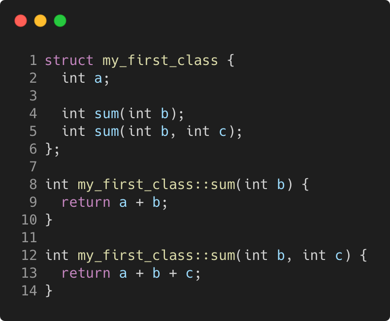

# method_overloading

Modern C++ course `method_overloading` example.



## Source

[method_overloading.cpp](method_overloading.cpp)

[CMakeLists.txt](CMakeLists.txt)

## Output

```
my_obj.sum(4, 6) = 12
```

## Build and run

To build `method_overloading` project, open "Terminal" and type following lines:

### Windows :

``` shell
mkdir build && cd build
cmake .. 
start method_overloading.sln
```

Select `method_overloading` project and type Ctrl+F5 to build and run it.

### macOS :

``` shell
mkdir build && cd build
cmake .. -G "Xcode"
open ./method_overloading.xcodeproj
```

Select `method_overloading` project and type Cmd+R to build and run it.

### Linux :

``` shell
mkdir build && cd build
cmake .. 
cmake --build . --config Debug
./method_overloading
```

### Linux with Visual Studio Code :

* Launch Visual Studio Code.
* Select `File/Open Folder...` menu.
* Select `method_overloading` folder and open it.
* Build and Run `method_overloading` project.
