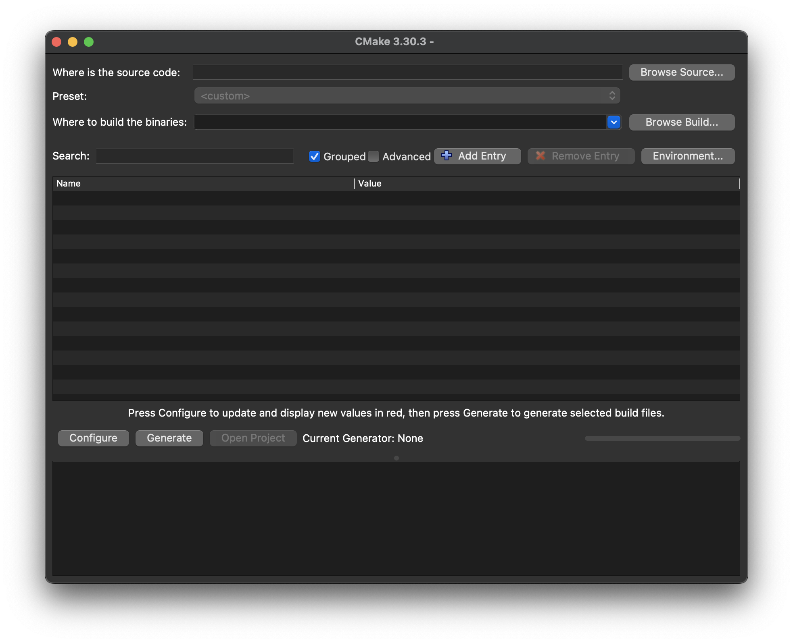
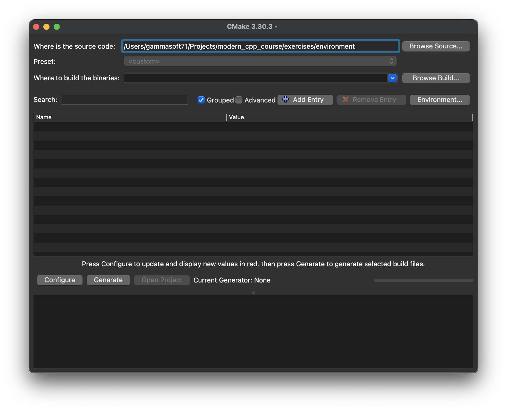
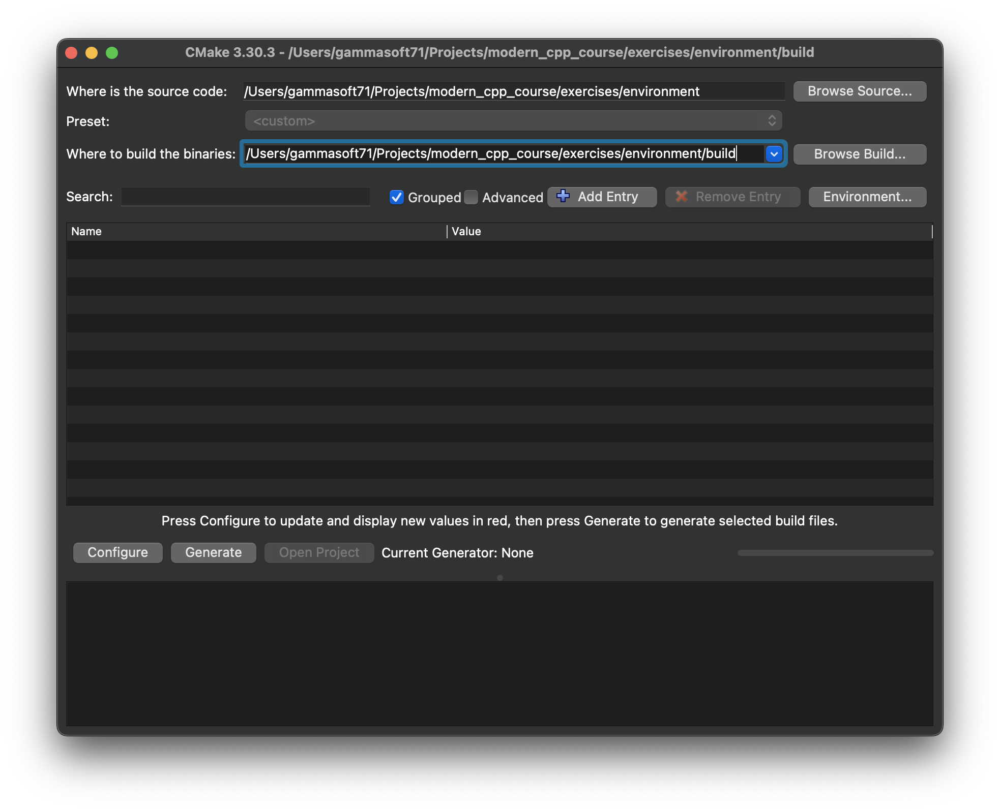
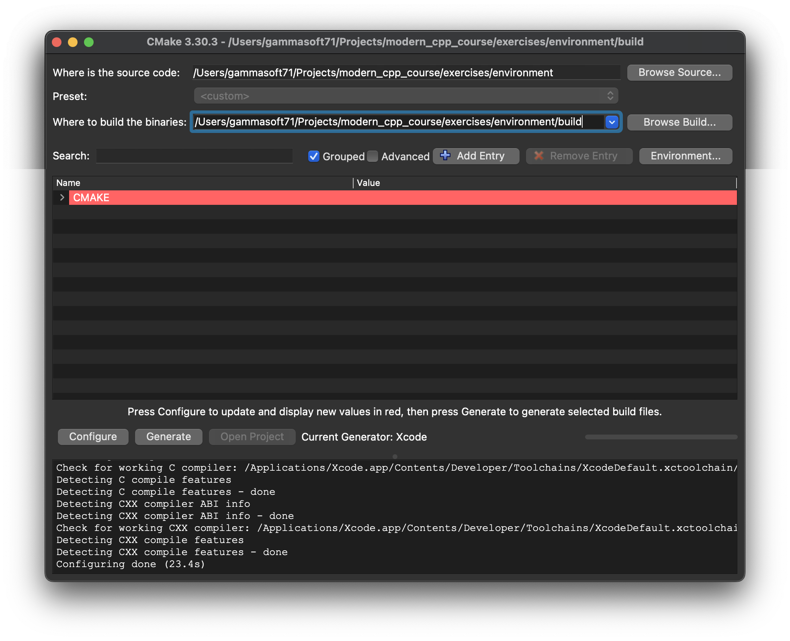
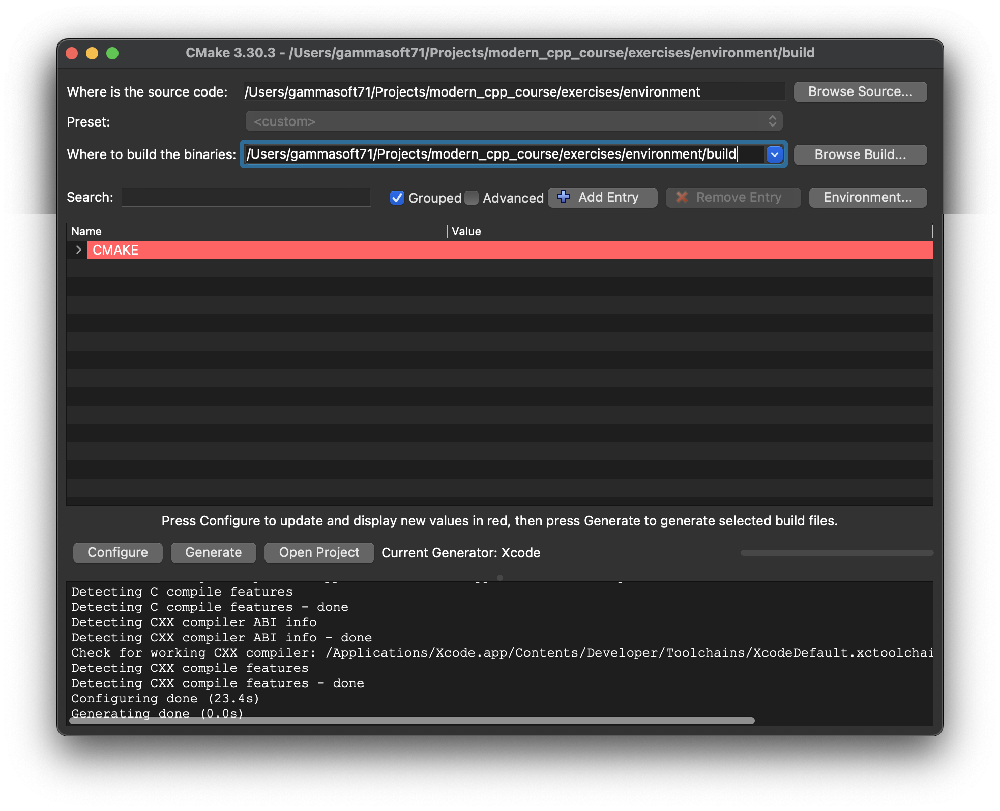
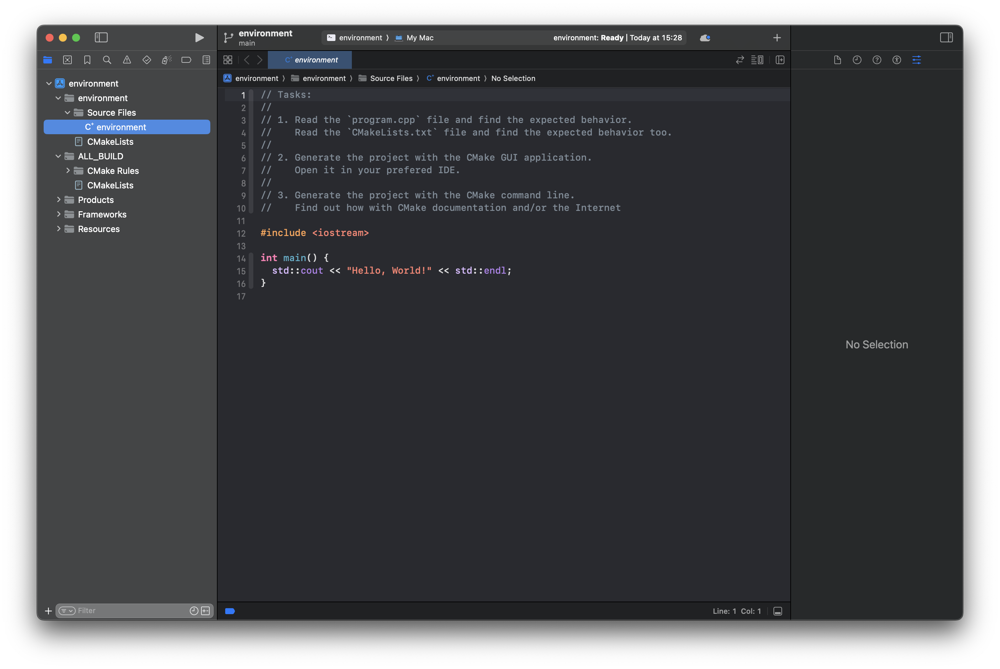
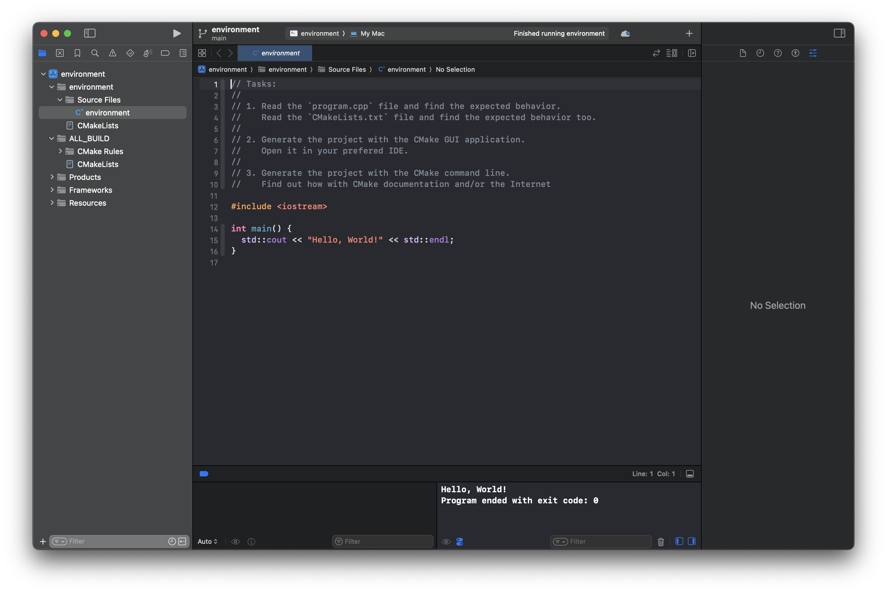

# Development environment

Generate, open and run the first classic application on your setup.

# Prerequisites

Your development environment must be installed.

For example Visual Studio C++ on Windows, Xcode on macOS and Visual Studio Code on Linux.

Don't forget to install compiler on Linux gcc or clang.

# Instruction

## Step 1

* Read the `program.cpp` file and find the expected behavior.
* Read the `CMakeLists.txt` file and find the expected behavior too.

## Step 2

* Generate the project with the CMake GUI application.
* Open it in your prefered IDE.

## Step 3

* Generate the project with the CMake command line.
* Find out how with CMake documentation and/or the Internet

# Solution

## Step 1

`program.cpp` and `CMakeLists.txt` files read.

## Step2

* Open the CMake GUI application



* Click on "Browse Sources..." button and select the "environment" folder



* Copy the path from "Where is the source code:", past it in the "Where to build the binaries:" and add "/build".



* Click on "Configure" button and select the generator.



* Click on "Generate" button to generate the project.



* Click on “Open project” button.



* Run `environment`



## Step 3

To build `environment ` project, open "Terminal" and type following lines:

### Windows :

``` shell
mkdir build && cd build
cmake .. 
start environment.sln
```

Select `environment ` project and type Ctrl+F5 to build and run it.

### macOS :

``` shell
mkdir build && cd build
cmake .. -G "Xcode"
open ./environment.xcodeproj
```

Select `environment ` project and type Cmd+R to build and run it.

### Linux :

``` shell
mkdir build && cd build
cmake .. 
cmake --build . --config Debug
./environment
```

### Linux with Visual Studio Code :

Launch Visual Studio Code.
Select `File/Open Folder..` menu.
Select `environment ` folder and open it.
Build and Run `environment ` project.
